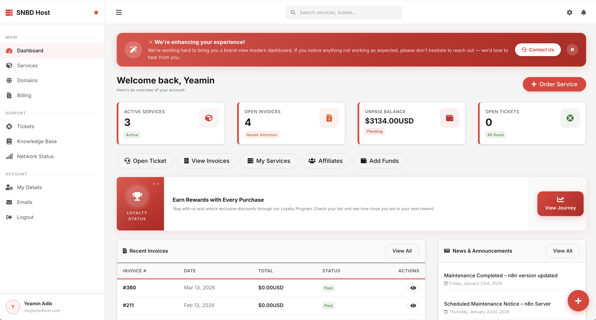
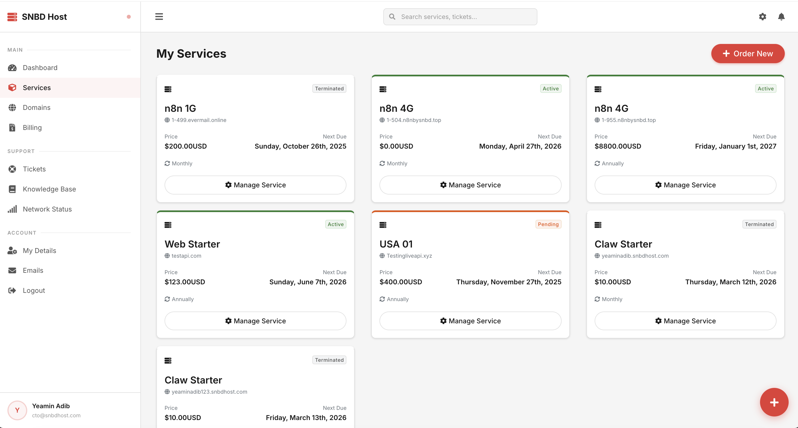
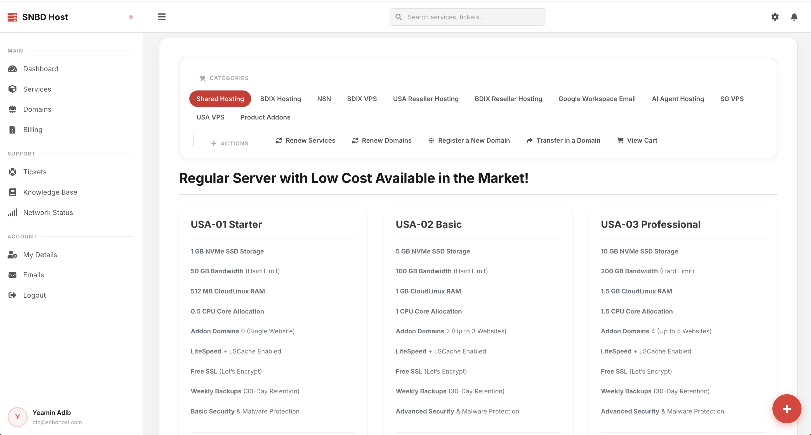
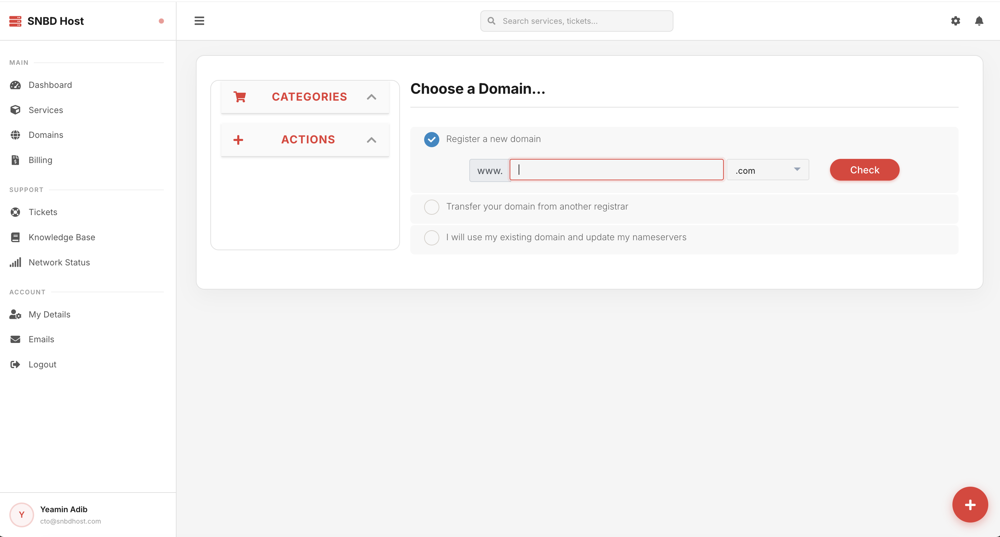

<p align="center">
  
  
  
  
  
</p>

<h1 align="center">
  🖥️ SNBD Host — WHMCS Portal Theme
</h1>

<p align="center">
  <strong>A fully custom, modern SaaS-style WHMCS client area theme for <a href="https://snbdhost.com">SNBD Host</a>.</strong><br/>
  Built with Bootstrap 5, Inter typography, and a bold Red &amp; White brand system.
</p>

---

## 🚀 What's New in v2.0.0 (Stable)

| Area | Change |
|------|--------|
| 🛒 **Cart — CSS Specificity** | All cart styles now use `#order-standard_cart` / `#order-snbdhost_cart` prefixes to fully override WHMCS default styles |
| 🛒 **Cart — Review & Checkout** | Redesigned cart item rows, order summary sidebar, promo tabs, and payment gateway selector |
| 🛒 **Cart — Complete Page** | Premium animated order confirmation with hero checkmark icon, status grid, and CTA buttons |
| 🧾 **Invoice Detail Page** | Fixed broken layout (removed standalone HTML shell) — now renders inside the portal with sidebar/topbar |
| 🧾 **Invoice Detail UI** | Premium invoice card with brand-red top border, address grid, styled line items table, pay button, print/back actions |
| 🎫 **Support Tickets** | Fully redesigned ticket list and ticket view pages with chat-bubble UI |
| 📦 **Both ZIPs updated** | `snbdhost_theme.zip` and `snbdhost_cart.zip` repackaged with all v2.0.0 changes |

<p align="center">
  <a href="#-screenshots">Screenshots</a> •
  <a href="#-features">Features</a> •
  <a href="#-file-structure">File Structure</a> •
  <a href="#-installation">Installation</a> •
  <a href="#-tech-stack">Tech Stack</a> •
  <a href="#-customization">Customization</a>
</p>

---

## 📸 Screenshots

<table>
  <tr>
    <td align="center" width="50%">
      
      <br/><strong>Dashboard</strong>
    </td>
    <td align="center" width="50%">
      
      <br/><strong>My Services</strong>
    </td>
  </tr>
  <tr>
    <td align="center" width="50%">
      
      <br/><strong>Invoices</strong>
    </td>
    <td align="center" width="50%">
      
      <br/><strong>Invoice Detail</strong>
    </td>
  </tr>
</table>

---

## ✨ Features

| Feature | Description |
|---------|-------------|
| 🎨 **SaaS Dashboard UI** | Modern two-panel layout — collapsible sidebar + sticky topbar |
| 📊 **Stat Cards** | Animated metric cards for services, invoices, balance & tickets |
| 🏆 **Loyalty Matrix** | Full-width loyalty tier card with animated progress bar |
| 🧾 **Custom Invoice** | Standalone branded invoice viewer with gateway selector |
| 💳 **Gateway Switcher** | Pill-style payment method toggle on invoice pages |
| 🔍 **Working Search** | Topbar search that queries the WHMCS Knowledge Base |
| 🎫 **Ticket Chat UI** | Chat-bubble style ticket thread with avatar initials |
| ⚡ **Quick Actions FAB** | Floating action button with radial menu (ticket, invoice, order) |
| 🔐 **Premium Auth Pages** | Login, register & password reset with particle.js backgrounds |
| 🛒 **Custom Order Cart** | Fully themed shopping cart with red & white brand system |
| 📱 **Fully Responsive** | Mobile-first with sidebar drawer and adaptive layouts |
| 🪝 **PHP Hooks** | Server-side hooks for dashboard data (loyalty, recent invoices) |

---

## 📁 File Structure

```
SNBDHOST Portal template/
│
├── 📄 README.md                          # ← You are here
├── 📁 screenshots/                       # UI screenshots for documentation
│
└── 📁 templates/
    │
    ├── 📁 snbdhost/                      # ═══ MAIN CLIENT AREA THEME ═══
    │   │
    │   ├── 📄 header.tpl                 # HTML head, sidebar nav, topbar, search
    │   ├── 📄 footer.tpl                 # FAB button, loader, JS dependencies
    │   │
    │   ├── ── Pages ──────────────────
    │   ├── 📄 clientareahome.tpl         # Dashboard (stats, loyalty, invoices, news)
    │   ├── 📄 clientareaproducts.tpl     # My Services — card grid layout
    │   ├── 📄 clientareainvoices.tpl     # Invoice list — sortable table
    │   ├── 📄 viewinvoice.tpl           # Invoice detail — standalone branded page
    │   ├── 📄 supportticketslist.tpl     # Support tickets list
    │   ├── 📄 viewticket.tpl            # Ticket thread — chat bubble UI
    │   │
    │   ├── ── Auth ───────────────────
    │   ├── 📄 login.tpl                  # Login page with particles background
    │   ├── 📄 clientregister.tpl         # Registration page
    │   ├── 📄 pwreset.tpl               # Password reset page
    │   │
    │   ├── ── Hooks (PHP) ────────────
    │   ├── 📄 snbdhost_dashboard_hook.php       # Injects loyalty data into dashboard
    │   ├── 📄 snbdhost_recent_invoices_hook.php  # Fetches recent invoices for dashboard
    │   │
    │   ├── ── Assets ─────────────────
    │   ├── 📁 assets/
    │   │   ├── 📁 css/
    │   │   │   └── 📄 snbdhost-theme.css   # Master theme: layout, sidebar, cards, auth
    │   │   └── 📁 js/
    │   │       └── 📄 snbdhost-theme.js    # Sidebar toggle, FAB, particles, validation
    │   │
    │   ├── 📁 css/                        # WHMCS core CSS overrides
    │   │   ├── 📄 all.css                 # Compiled base styles
    │   │   ├── 📄 custom.css              # Additional customizations
    │   │   ├── 📄 invoice.css             # Invoice PDF/view styles
    │   │   ├── 📄 theme.css               # WHMCS theme base
    │   │   ├── 📄 store.css               # Marketplace store styles
    │   │   ├── 📄 dynamic-store.css       # Dynamic store overrides
    │   │   └── 📄 oauth.css               # OAuth flow styles
    │   │
    │   ├── 📁 js/                         # WHMCS core JS
    │   │   ├── 📄 scripts.js              # Core WHMCS scripts
    │   │   └── 📄 whmcs.js                # WHMCS utility functions
    │   │
    │   ├── 📁 images/                     # Theme images
    │   ├── 📁 img/                        # Additional images
    │   └── 📄 theme.yaml                  # WHMCS theme config (fallback: twenty-one)
    │
    └── 📁 orderforms/
        │
        ├── 📁 snbdhost_cart/              # ═══ CUSTOM ORDER FORM ═══
        │   │
        │   ├── 📄 common.tpl              # Shared CSS/JS imports
        │   ├── 📄 products.tpl            # Product listing page
        │   ├── 📄 configureproduct.tpl    # Product configuration
        │   ├── 📄 configureproductdomain.tpl  # Domain selection step
        │   ├── 📄 configuredomains.tpl    # Domain configuration
        │   ├── 📄 domainregister.tpl      # Domain registration
        │   ├── 📄 domaintransfer.tpl      # Domain transfer
        │   ├── 📄 domainoptions.tpl       # Domain addons
        │   ├── 📄 viewcart.tpl            # Shopping cart view
        │   ├── 📄 checkout.tpl            # Checkout form
        │   ├── 📄 addons.tpl              # Product addons step
        │   ├── 📄 ordersummary.tpl        # Order summary
        │   ├── 📄 complete.tpl            # Order confirmation
        │   ├── 📄 error.tpl               # Error page
        │   ├── 📄 fraudcheck.tpl          # Fraud verification
        │   ├── 📄 linkedaccounts.tpl      # Linked accounts
        │   ├── 📄 marketconnect-promo.tpl # MarketConnect promo
        │   ├── 📄 recommendations-modal.tpl  # Product recommendations
        │   ├── 📄 domain-renewals.tpl     # Domain renewal
        │   ├── 📄 service-renewals.tpl    # Service renewal
        │   ├── 📄 service-renewal-item.tpl # Individual renewal item
        │   │
        │   ├── 📄 sidebar-categories.tpl           # Sidebar category nav
        │   ├── 📄 sidebar-categories-collapsed.tpl  # Collapsed variant
        │   ├── 📄 sidebar-categories-selector.tpl   # Category selector
        │   │
        │   ├── 📁 css/
        │   │   ├── 📄 custom.css          # Custom cart styles (Red & White)
        │   │   ├── 📄 all.css             # Compiled base styles
        │   │   └── 📄 style.css           # Additional style overrides
        │   │
        │   ├── 📁 js/                     # Cart JavaScript
        │   ├── 📁 includes/               # Partial templates
        │   │   ├── 📄 existing-paymethods.tpl
        │   │   └── 📄 product-recommendations.tpl
        │   │
        │   └── 📄 theme.yaml             # Cart theme config
        │
        └── 📁 orderforms-standard_cart/   # ═══ STANDARD CART (BACKUP) ═══
            └── ...                        # Default WHMCS cart templates
```

---

## 🚀 Installation

### Prerequisites

- **WHMCS** 8.x or later
- **PHP** 7.4+
- **Bootstrap 5.3** (loaded via CDN — no build step required)

### Steps

```bash
# 1. Clone or download this repository
git clone https://github.com/yeaminlabs/snbdhost-whmcs-template.git

# 2. Copy the client area theme to your WHMCS templates directory
cp -r templates/snbdhost /path/to/whmcs/templates/

# 3. Copy the order form to your WHMCS order form directory  
cp -r templates/orderforms/snbdhost_cart /path/to/whmcs/templates/orderforms/

# 4. Set the theme in WHMCS Admin
#    → Setup → General Settings → Ordering tab
#    → Template: snbdhost
#    → Order Form Template: snbdhost_cart

# 5. Copy hook files (if using Loyalty Matrix integration)
cp templates/snbdhost/snbdhost_dashboard_hook.php /path/to/whmcs/includes/hooks/
cp templates/snbdhost/snbdhost_recent_invoices_hook.php /path/to/whmcs/includes/hooks/
```

### Theme Configuration

The `theme.yaml` file specifies the fallback parent theme:

```yaml
# templates/snbdhost/theme.yaml
parent: twenty-one
```

> Any template file not found in `snbdhost/` will automatically fall back to the `twenty-one` default WHMCS theme.

---

## 🛠 Tech Stack

| Layer | Technology |
|-------|-----------|
| **Framework** | WHMCS 8.x (Smarty Templates) |
| **CSS Framework** | Bootstrap 5.3 (CDN) |
| **Typography** | Inter (Google Fonts) |
| **Icons** | Font Awesome 6.4 (CDN) |
| **Animations** | Particle.js (auth pages), CSS keyframes |
| **JavaScript** | Vanilla JS — no jQuery dependency for custom code |
| **PHP Hooks** | WHMCS Hook System (dashboard data injection) |

---

## 🎨 Customization

### Brand Colors

All colors are defined as CSS custom properties in `snbdhost-theme.css`:

```css
:root {
  --brand-primary: #e53935;      /* Main brand red */
  --brand-hover: #c62828;        /* Darker hover state */
  --brand-light: rgba(229, 57, 53, 0.06);  /* Tinted backgrounds */
  
  --bg-body: #f5f5f5;            /* Page background */
  --bg-surface: #ffffff;         /* Card/panel backgrounds */
  --text-primary: #1a1a1a;       /* Main text */
  --text-secondary: #555555;     /* Secondary text */
}
```

To rebrand, simply change `--brand-primary` and `--brand-hover` — all components will update automatically.

### Layout Dimensions

```css
:root {
  --sidebar-w: 260px;            /* Sidebar width (expanded) */
  --sidebar-w-collapsed: 68px;   /* Sidebar width (collapsed) */
  --topbar-h: 56px;              /* Top navigation bar height */
}
```

---

## 📋 Template Variable Reference

| Variable | Source | Used In |
|----------|--------|---------|
| `{$clientsdetails}` | WHMCS Core | header, dashboard |
| `{$clientsstats}` | WHMCS Core | dashboard stat cards |
| `{$homepageproducts}` | WHMCS Core | dashboard services table |
| `{$invoices}` | WHMCS Core | dashboard + invoices page |
| `{$announcements}` | WHMCS Core | dashboard news panel |
| `{$gateways}` | WHMCS Core | invoice gateway switcher |
| `{$loyalty_data}` | Custom Hook | dashboard loyalty card |

---

## 🔗 Related Modules

| Module | Description |
|--------|-------------|
| **Loyalty Matrix** | Tiered discount system — data displayed on dashboard |
| **Custom Hooks** | PHP hooks inject additional data into Smarty templates |

---

## 📄 License

This theme is proprietary software developed for **SNBD Host**. All rights reserved.

---

<p align="center">
  <sub>Built with ❤️ by the <strong>SNBD Host</strong> team — Dhaka, Bangladesh</sub>
</p>
