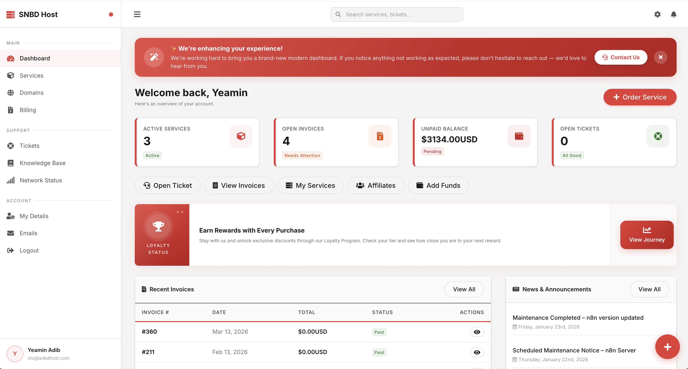
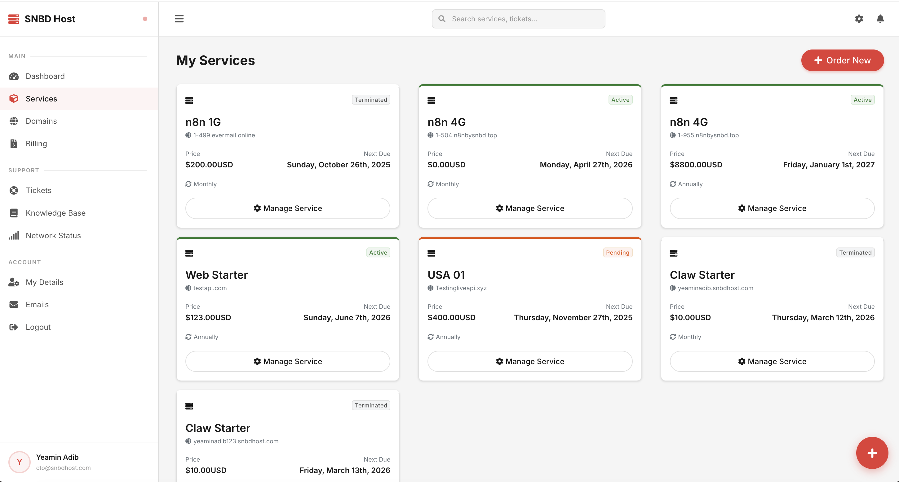
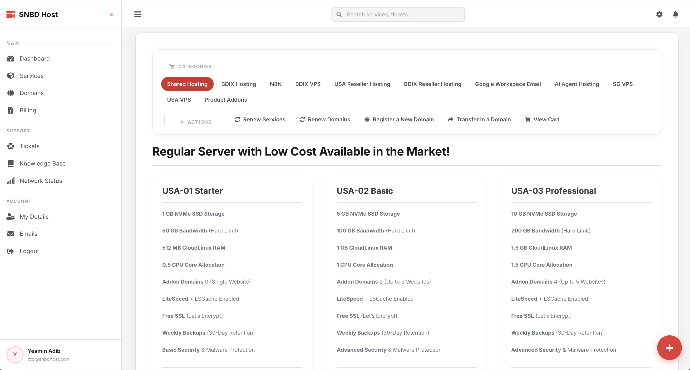
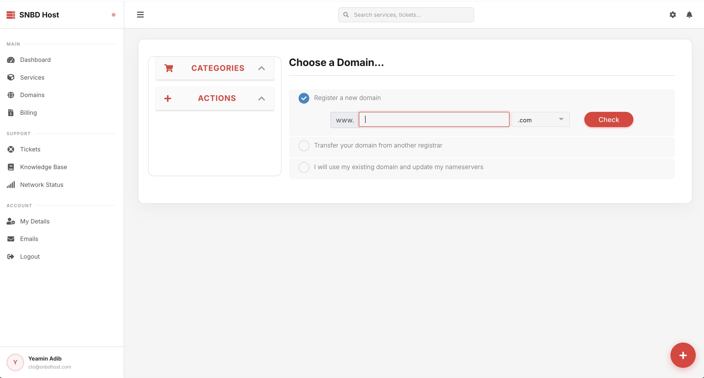

<div align="center">

# 🖥️ SNBD Host — WHMCS Portal Theme

### A fully custom, SaaS-grade WHMCS client area for [SNBD Host](https://snbdhost.com)


Built with Bootstrap 5, Inter typography, and a bold **Red & White** brand system —
themed templates on the front end, PHP hooks on the back end.

</div>

<br/>

<div align="center">

[**Screenshots**](#-screenshots) · [**How It Works**](#-how-it-works) · [**Hooks**](#-hooks) · [**Features**](#-features) · [**File Structure**](#-file-structure) · [**Installation**](#-installation) · [**Customization**](#-customization)

</div>

<br/>

---

<br/>

## 🚀 What's New in v2.0.0

<table>
<tr><th align="left" width="200">Area</th><th align="left">Change</th></tr>
<tr><td>🛒 Cart — Specificity</td><td>All cart styles now scoped under <code>#order-standard_cart</code> / <code>#order-snbdhost_cart</code> to fully override WHMCS defaults</td></tr>
<tr><td>🛒 Cart — Checkout</td><td>Redesigned cart item rows, order summary sidebar, promo tabs, and payment gateway selector</td></tr>
<tr><td>🛒 Cart — Complete Page</td><td>Premium animated order confirmation with hero checkmark icon, status grid, and CTA buttons</td></tr>
<tr><td>🧾 Invoice Detail</td><td>Fixed broken standalone-HTML layout — now renders inside the portal shell with sidebar/topbar</td></tr>
<tr><td>🧾 Invoice Detail UI</td><td>Premium invoice card, brand-red top border, address grid, styled line items, pay/print/back actions</td></tr>
<tr><td>🎫 Support Tickets</td><td>Fully redesigned ticket list and chat-bubble ticket thread</td></tr>
<tr><td>🤖 n8n Dashboard</td><td>Client-side transformer embeds a modern dashboard UI directly into n8n product pages, driven by admin-configurable hooks</td></tr>
<tr><td>📦 Distribution</td><td><code>snbdhost-portal-theme1.zip</code> and <code>snbdhost_cart.zip</code> repackaged with all v2.0.0 changes</td></tr>
</table>

<br/>

---

<br/>

## 📸 Screenshots

<table>
<tr>
<td align="center" width="50%"><br/><sub><b>Dashboard</b></sub></td>
<td align="center" width="50%"><br/><sub><b>My Services</b></sub></td>
</tr>
<tr>
<td align="center" width="50%"><br/><sub><b>Invoices</b></sub></td>
<td align="center" width="50%"><br/><sub><b>Invoice Detail</b></sub></td>
</tr>
</table>

<br/>

---

<br/>

## 🧩 How It Works

This project is **two systems working together**:

1. **The theme** (`templates/snbdhost/`) — Smarty `.tpl` files, CSS, and JS that WHMCS renders whenever a client loads the portal. This is purely presentational: it receives variables from WHMCS core and from hooks, and renders them.
2. **The logic layer** (`includes/hooks/` + `modules/addons/snbdhost_manager/`) — PHP that runs *before* the templates render, using the WHMCS **Hooks API** to inject extra data, intercept requests, validate forms, and rewrite HTML output.

```
┌─────────────────────────────────────────────────────────────────────┐
│  1. Client requests a page  (e.g. clientarea.php?action=home)       │
└───────────────────────────────┬─────────────────────────────────────┘
                                 ▼
┌─────────────────────────────────────────────────────────────────────┐
│  2. WHMCS core builds the default $vars for that page                │
└───────────────────────────────┬─────────────────────────────────────┘
                                 ▼
┌─────────────────────────────────────────────────────────────────────┐
│  3. WHMCS fires named hook points — every add_hook() listening on    │
│     that point runs and can return extra Smarty variables or HTML    │
│                                                                       │
│     includes/hooks/snbdhost_dashboard_hook.php  ─┐                    │
│     modules/addons/snbdhost_manager/hooks.php    ─┼─► merged into     │
│                                                    │   the template   │
│                                                    │   variable pool  │
└───────────────────────────────┬─────────────────────────────────────┘
                                 ▼
┌─────────────────────────────────────────────────────────────────────┐
│  4. Smarty renders templates/snbdhost/*.tpl using WHMCS core vars     │
│     PLUS everything the hooks injected ($loyalty_data, $open_tickets, │
│     turnstileEnabled, googleClientId, affiliateProductGroups, ...)    │
└───────────────────────────────┬─────────────────────────────────────┘
                                 ▼
┌─────────────────────────────────────────────────────────────────────┐
│  5. theme.yaml falls back to the stock "twenty-one" theme for any     │
│     template file that snbdhost/ doesn't override                    │
└─────────────────────────────────────────────────────────────────────┘
```

**Why hooks instead of editing WHMCS core?** WHMCS core files are overwritten on every WHMCS update. Hooks and theme overrides live entirely outside core, so the customizations in this repo survive WHMCS upgrades untouched.

**The addon module** (`snbdhost_manager`) is the admin-facing control panel for the whole system — it stores settings in `tbladdonmodules` (GitHub repo for one-click updates, UptimeRobot API key, Google OAuth client ID, Turnstile keys, n8n promo copy, developer mode) that the hooks read at runtime. Nothing is hardcoded — every togglable behavior below is configured from **Addons → SNBDHost Theme Manager** in the WHMCS admin.

<br/>

---

<br/>

## 🪝 Hooks

All server-side logic lives in two hook files, both using WHMCS's `add_hook('EventName', priority, callback)` API. Hooks are the **only** supported way this theme talks to the database or intercepts requests — templates themselves stay logic-free.

<table>
<tr><th align="left" width="230">File</th><th align="left">Role</th></tr>
<tr>
<td><code>includes/hooks/<br/>snbdhost_dashboard_hook.php</code></td>
<td>Standalone, dependency-free hook file. Feeds the dashboard and affiliates page with data the stock WHMCS theme doesn't provide.</td>
</tr>
<tr>
<td><code>modules/addons/<br/>snbdhost_manager/hooks.php</code></td>
<td>Bundled with the <b>SNBDHost Theme Manager</b> addon module. Everything here reads its configuration from the addon's settings, so it can be toggled without touching code.</td>
</tr>
</table>

### `includes/hooks/snbdhost_dashboard_hook.php`

| Hook Point | Purpose |
|---|---|
| `ClientAreaPageHome` | Queries `tblinvoices`, `tblhosting`, `mod_loyaltymatrix_*`, and `tbltickets` directly via `Capsule` to build `$invoices` (last 5), `$services` (active/pending), `$loyalty_data` (tier + progress to next tier), and `$open_tickets` (last 5 unresolved) — all in the client's own currency format. |
| `ClientAreaPageAffiliates` | Builds `$affiliateProductGroups`, a nested list of visible product groups and their products, used to power custom referral-link generation on the affiliates page. |

Both hooks wrap every query in `try/catch (\Throwable)` and return an empty result on failure rather than throwing — a broken Loyalty Matrix install, for example, degrades the dashboard gracefully instead of white-screening it.

### `modules/addons/snbdhost_manager/hooks.php`

| Hook Point | Purpose |
|---|---|
| `ClientAreaPage` *(×2)* | (1) Handles the AJAX profile-completion form (`snbd_action=save_profile`) posted from the dashboard modal, validating and forwarding to the `UpdateClient` API. (2) Exposes `$googleClientId` to `login`/`clientregister` templates, and `turnstileEnabled` / `turnstileSiteKey` to every page when Cloudflare Turnstile is turned on. |
| `ClientAreaPrimarySidebar` | Removes the **Security Settings** sidebar link for accounts still carrying placeholder OAuth profile data, until the client completes their profile. |
| `AdminHomeWidgets` | Registers `SnbdhostThemeWidget`, a WHMCS admin dashboard widget (theme/version status at a glance). |
| `AdminAreaFooterOutput` | Renders `DashboardTopNotice` (update/announcement banner) on the admin dashboard only. |
| `ClientAreaPageHome` | Reads the addon's `developer_mode` and n8n-promo settings from `tbladdonmodules`, checks whether the client owns an n8n product, and exposes the promo title/description/URL/button text used by the in-dashboard n8n masterclass segment. |
| `ClientAreaFooterOutput` *(×2)* | (1) Injects the profile-completion modal markup on `clientareahome` when required fields are still placeholder values. (2) On `clientareaproductdetails`, runs the **client-side n8n dashboard transformer** as a JS fallback when the server-side output hook (below) didn't already convert the page. |
| `init` | Fires before routing on every request. When Turnstile is enabled, intercepts `login.php`, `contact.php`, and `pwreset.php` `POST`s early to validate the captcha token before WHMCS processes the form. |
| `ClientDetailsValidation` | Rejects client registration when Turnstile is enabled and the submitted token fails verification. |
| `ShoppingCartValidateCheckout` | Rejects checkout submission on captcha failure, same Turnstile flow, scoped to the cart. |
| `TicketOpenValidation` | Rejects new support ticket submission on captcha failure. |
| `ClientAreaProductDetailsOutput` | Server-side rewrite: detects n8n products by name/module/domain heuristics (`isSnbdhostN8nProduct()`) and replaces the raw module HTML with `renderSnbdhostN8nDashboardHtml()` — a themed dashboard — **before** it ever reaches the template. |
| `ClientAreaPageProductDetails` | Same n8n detection, applied to `$vars['tplOverviewTabOutput']` / `$vars['moduleclientarea']` so the transform also covers the overview tab path some server modules use instead of raw output. |

> **Design note:** the two n8n hooks (`ClientAreaProductDetailsOutput` + `ClientAreaPageProductDetails`) intentionally overlap — different server modules populate different variables, so both paths are covered. The `ClientAreaFooterOutput` JS transformer is the last-resort fallback if neither PHP hook could rewrite the HTML (e.g. content loaded via a later AJAX call).

### Installing the hooks

```bash
# Standalone dashboard hook
cp includes/hooks/snbdhost_dashboard_hook.php /path/to/whmcs/includes/hooks/

# Addon module (bundles its own hooks.php — installs automatically once activated)
cp -r modules/addons/snbdhost_manager /path/to/whmcs/modules/addons/
# Then in WHMCS Admin → System Settings → Addon Modules → Activate "SNBDHost Theme Manager"
```

Hook files are auto-loaded by WHMCS on every request from `includes/hooks/` — no registration step needed beyond copying the file. Addon-module hooks load automatically once the module is activated from **Addons**.

<br/>

---

<br/>

## ✨ Features

<table>
<tr><td width="33%">🎨 <b>SaaS Dashboard UI</b><br/><sub>Two-panel layout — collapsible sidebar + sticky topbar</sub></td>
<td width="33%">📊 <b>Stat Cards</b><br/><sub>Animated metric cards for services, invoices, balance & tickets</sub></td>
<td width="33%">🏆 <b>Loyalty Matrix</b><br/><sub>Full-width tier card with animated progress bar</sub></td></tr>
<tr><td>🧾 <b>Custom Invoice</b><br/><sub>Standalone branded invoice viewer with gateway selector</sub></td>
<td>💳 <b>Gateway Switcher</b><br/><sub>Pill-style payment method toggle on invoice pages</sub></td>
<td>🔍 <b>Working Search</b><br/><sub>Topbar search that queries the WHMCS Knowledge Base</sub></td></tr>
<tr><td>🎫 <b>Ticket Chat UI</b><br/><sub>Chat-bubble ticket thread with avatar initials</sub></td>
<td>⚡ <b>Quick Actions FAB</b><br/><sub>Floating action button with radial menu (ticket, invoice, order)</sub></td>
<td>🔐 <b>Premium Auth Pages</b><br/><sub>Login, register & password reset with particle.js backgrounds</sub></td></tr>
<tr><td>🛒 <b>Custom Order Cart</b><br/><sub>Fully themed shopping cart, red & white brand system</sub></td>
<td>📱 <b>Fully Responsive</b><br/><sub>Mobile-first with sidebar drawer and adaptive layouts</sub></td>
<td>🤖 <b>n8n Dashboard</b><br/><sub>Auto-transforms n8n product pages into a modern client dashboard</sub></td></tr>
<tr><td>🛡️ <b>Cloudflare Turnstile</b><br/><sub>Optional captcha across login, register, checkout & tickets</sub></td>
<td>🔑 <b>Google Sign-In</b><br/><sub>OAuth login/register, client ID managed from the addon</sub></td>
<td>🪝 <b>PHP Hooks</b><br/><sub>Server-side hooks power everything above — see <a href="#-hooks">Hooks</a></sub></td></tr>
</table>

<br/>

---

<br/>

## 📁 File Structure

```
SNBDHOST Portal template/
│
├── 📄 README.md                              ← You are here
├── 📁 screenshots/                           UI screenshots for documentation
│
├── 📁 includes/                              ═══ STANDALONE HOOK ═══
│   └── 📁 hooks/
│       └── 📄 snbdhost_dashboard_hook.php     Dashboard + affiliates data injection
│
├── 📁 modules/                                ═══ ADDON MODULE ═══
│   └── 📁 addons/
│       └── 📁 snbdhost_manager/
│           ├── 📄 snbdhost_manager.php        Config, activation, admin settings UI
│           ├── 📄 hooks.php                   14 hook points — see Hooks section
│           └── 📁 lib/
│               ├── 📄 SnbdhostThemeWidget.php  Admin dashboard widget
│               ├── 📄 DashboardTopNotice.php   Admin update/announcement banner
│               ├── 📄 ModuleManager.php        Managed external module installer
│               └── 📄 Updater.php              One-click GitHub theme updater
│
└── 📁 templates/
    │
    ├── 📁 snbdhost/                           ═══ CLIENT AREA THEME ═══
    │   ├── 📄 header.tpl                      HTML head, sidebar nav, topbar, search
    │   ├── 📄 footer.tpl                      FAB button, loader, JS dependencies
    │   │
    │   ├── ── Pages ──────────────────────
    │   ├── 📄 clientareahome.tpl              Dashboard (stats, loyalty, invoices, news)
    │   ├── 📄 clientareaproducts.tpl          My Services — card grid layout
    │   ├── 📄 clientareaproductdetails.tpl    Product details — n8n dashboard embed target
    │   ├── 📄 clientareainvoices.tpl          Invoice list — sortable table
    │   ├── 📄 viewinvoice.tpl                 Invoice detail — standalone branded page
    │   ├── 📄 supportticketslist.tpl          Support tickets list
    │   ├── 📄 viewticket.tpl                  Ticket thread — chat bubble UI
    │   │
    │   ├── ── Auth ───────────────────────
    │   ├── 📄 login.tpl                       Login page with particles background
    │   ├── 📄 clientregister.tpl              Registration page
    │   ├── 📄 pwreset.tpl                     Password reset page
    │   │
    │   ├── ── Assets ─────────────────────
    │   ├── 📁 assets/
    │   │   ├── 📁 css/snbdhost-theme.css       Master theme: layout, sidebar, cards, auth
    │   │   └── 📁 js/snbdhost-theme.js         Sidebar toggle, FAB, particles, validation
    │   │
    │   ├── 📁 css/                            WHMCS core CSS overrides
    │   ├── 📁 js/                             WHMCS core JS
    │   ├── 📁 images/ · 📁 img/                Theme images
    │   └── 📄 theme.yaml                      WHMCS theme config (fallback: twenty-one)
    │
    └── 📁 orderforms/
        ├── 📁 snbdhost_cart/                  ═══ CUSTOM ORDER FORM ═══
        │   ├── 📄 common.tpl · products.tpl · configureproduct.tpl · checkout.tpl
        │   ├── 📄 viewcart.tpl · complete.tpl · fraudcheck.tpl · error.tpl
        │   ├── 📄 domainregister.tpl · domaintransfer.tpl · domainoptions.tpl
        │   ├── 📁 css/custom.css               Custom cart styles (Red & White)
        │   ├── 📁 js/ · 📁 includes/
        │   └── 📄 theme.yaml                   Cart theme config
        │
        └── 📁 orderforms-standard_cart/        ═══ STANDARD CART (backup) ═══
```

<br/>

---

<br/>

## 🚀 Installation

### Prerequisites

- **WHMCS** 8.x or later
- **PHP** 7.4+
- **Bootstrap 5.3** (loaded via CDN — no build step required)

### Steps

```bash
# 1. Clone or download this repository
git clone https://github.com/yeaminlabs/snbdhost-whmcs-template.git

# 2. Copy the client area theme
cp -r templates/snbdhost /path/to/whmcs/templates/

# 3. Copy the custom order form
cp -r templates/orderforms/snbdhost_cart /path/to/whmcs/templates/orderforms/

# 4. Copy the standalone dashboard hook
cp includes/hooks/snbdhost_dashboard_hook.php /path/to/whmcs/includes/hooks/

# 5. Copy and activate the addon module (bundles its own hooks + admin settings)
cp -r modules/addons/snbdhost_manager /path/to/whmcs/modules/addons/
#    → WHMCS Admin → System Settings → Addon Modules → Activate "SNBDHost Theme Manager"

# 6. Set the theme in WHMCS Admin
#    → Setup → General Settings → Ordering tab
#    → Template: snbdhost
#    → Order Form Template: snbdhost_cart
```

### Theme Configuration

```yaml
# templates/snbdhost/theme.yaml
parent: twenty-one
```

> Any template file not found in `snbdhost/` automatically falls back to the stock `twenty-one` WHMCS theme.

<br/>

---

<br/>

## 🛠 Tech Stack

| Layer | Technology |
|---|---|
| **Framework** | WHMCS 8.x (Smarty Templates + Hooks API) |
| **CSS Framework** | Bootstrap 5.3 (CDN) |
| **Typography** | Inter (Google Fonts) |
| **Icons** | Font Awesome 6.4 (CDN) |
| **Animations** | Particle.js (auth pages), CSS keyframes |
| **JavaScript** | Vanilla JS — no jQuery dependency for custom code |
| **Server Logic** | PHP hooks + `WHMCS\Database\Capsule` query builder |
| **Security** | Cloudflare Turnstile (optional captcha), Google OAuth 2.0 |

<br/>

---

<br/>

## 🎨 Customization

### Brand Colors

Defined as CSS custom properties in `snbdhost-theme.css` — change two variables and every component updates:

```css
:root {
  --brand-primary: #e53935;      /* Main brand red */
  --brand-hover: #c62828;        /* Darker hover state */
  --brand-light: rgba(229, 57, 53, 0.06);  /* Tinted backgrounds */

  --bg-body: #f5f5f5;            /* Page background */
  --bg-surface: #ffffff;         /* Card/panel backgrounds */
  --text-primary: #1a1a1a;       /* Main text */
  --text-secondary: #555555;     /* Secondary text */
}
```

### Layout Dimensions

```css
:root {
  --sidebar-w: 260px;            /* Sidebar width (expanded) */
  --sidebar-w-collapsed: 68px;   /* Sidebar width (collapsed) */
  --topbar-h: 56px;              /* Top navigation bar height */
}
```

<br/>

---

<br/>

## 📋 Template Variable Reference

| Variable | Source | Used In |
|---|---|---|
| `{$clientsdetails}` | WHMCS Core | header, dashboard |
| `{$clientsstats}` | WHMCS Core | dashboard stat cards |
| `{$homepageproducts}` | WHMCS Core | dashboard services table |
| `{$invoices}` | WHMCS Core + hook override | dashboard + invoices page |
| `{$announcements}` | WHMCS Core | dashboard news panel |
| `{$gateways}` | WHMCS Core | invoice gateway switcher |
| `{$loyalty_data}` | `snbdhost_dashboard_hook.php` | dashboard loyalty card |
| `{$open_tickets}` | `snbdhost_dashboard_hook.php` | dashboard open-tickets widget |
| `{$affiliateProductGroups}` | `snbdhost_dashboard_hook.php` | affiliates page |
| `{$googleClientId}` | `snbdhost_manager/hooks.php` | login, clientregister |
| `{$turnstileEnabled}` / `{$turnstileSiteKey}` | `snbdhost_manager/hooks.php` | login, register, checkout, tickets |

<br/>

---

<br/>

## 🔗 Related Modules

| Module | Description |
|---|---|
| **SNBDHost Theme Manager** | Addon module — one-click GitHub theme updates, managed module installer, admin widgets, and every setting the hooks read at runtime |
| **Loyalty Matrix** | Third-party tiered discount system — data surfaced on the dashboard via hooks |
| **n8n Dashboard Transformer** | Detects n8n hosting products and rewrites their module output into a themed client dashboard |

<br/>

---

<br/>

## 📄 License

This theme is proprietary software developed for **SNBD Host**. All rights reserved.

<br/>

<div align="center">
<sub>Built with ❤️ by the <strong>SNBD Host</strong> team — Dhaka, Bangladesh</sub>
</div>
